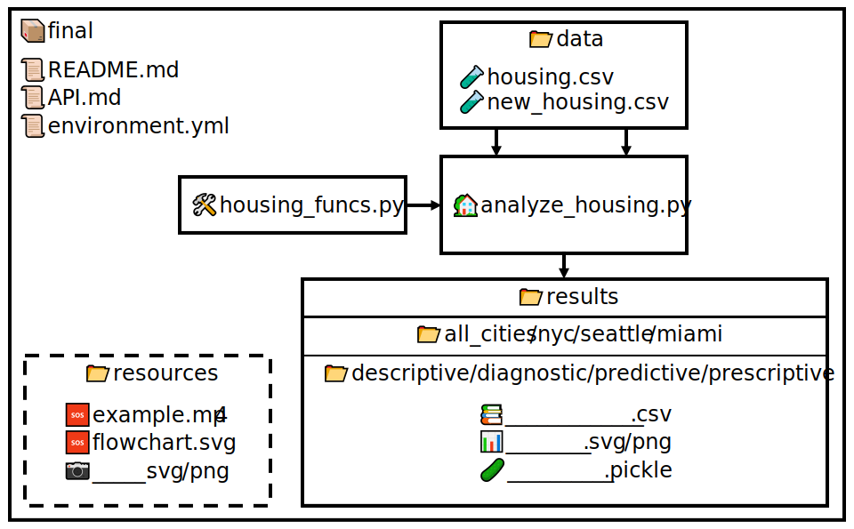

# API for US Housing Market Analysis

## Main Functionality

The main driver script is `🏡analyze_housing.py`, which uses utilities in `🛠️housing_funcs.py`. Start by inputting the data file, `🧪housing.csv`, found in the `data` directory, as shown below.

```bash
$ python analyze_housing.py data/housing.csv
```

If not already present, the program will create a `📂results` directory and populate it with subdirectories for `📂all_cities`,  `📂nyc`, `📂seattle`, and `📂miami`. Within each city will also be folders for `📂descriptive`, `📂diagnostic`, `📂predictive`, and `📂prescriptive` analytics.

Descriptive statistics and test results will be saved as `📚.csv` files, while figures and visualizations as `📊.svg` or `📊.png` images. Machine learning models will be saved as `🥒.pickle` files.

Please refer to the flowchart below if unclear. There is also an example run-through of the program on the [README](../README.md) page.



**Date Created**: 2023-12-11, 2:19 am \
**Last Modified**: 2023-12-12, 6:39 pm

[Back to Top](#api-for-us-housing-market-analysis)

<hr>

## Table of Contents

- [API for US Housing Market Analysis](#api-for-us-housing-market-analysis)
  - [Main Functionality](#main-functionality)
  - [Table of Contents](#table-of-contents)
  - [Functions](#functions)

<hr>

## Functions

1. `load_data`
   - **Original Author**
     - Jerry
   - **Description**
     - Loads data from a `🧪.csv` file into a `pandas` DataFrame.
   - **Inputs**
     - `filename`: file path to `🧪.csv` file.
     - `sep`: delimiter for `🧪.csv` file.
   - **Outputs**
     - `pandas` DataFrame with rows/indices as entries of different time points and and columns as different variables of each respective time point.

2. `clean_data`
   - **Original Authors**
     - Jerry, Kai, Nargiz
   - **Description**
     - Subsets data for a region and prepares it for statistical analyses.
     - Regions include New York City, Seattle, and Miami. Splits data into entries before and after August 2023. Variables of interest include listings and inventory, sales, and sale prices. Analysis parameters differ between Jerry, Kai, and Nargiz.
   - **Inputs**
     - `data`: Raw data in a `pandas` DataFrame.
     - `region`: City to be analyzed.
     - `analysis`: Pipeline of analysis for which to be used (`j`erry, `k`ai, or `n`argiz's pipeline).
   - **Outputs**
     - Cleaned data for the specified region and pipeline, split into data before and after August 2023.

3. `subset_data`
   - **Original Author**
     - Jerry
   - **Description**
     - Slices data for 5 variables most correlated with median sale price.
     - Data will also be prepared for OLS regression and comparison tests; region will be re-encoded as integers and dates will be dropped.
   - **Inputs**
     - `data`: Cleaned housing data in a `pandas` DataFrame.
   - **Outputs**
     - Subsetted `pandas` DataFrame with 5 variables most correlated with median sale price in New York.

4. `describe_data`
   - **Original Author**
     - Jerry
   - **Description**
     - Produces descriptive statistics for a given dataset.
     - Calculates the total number of days in the dataset, gives an overall  summary (min, mean, median, max, standard deviation, and standard error),   and gives a rolling monthly summary (mean) for each variable of interest.
   - **Inputs**
     - `data`: Cleaned housing data in a `pandas` DataFrame.
     - `save`: Boolean to save summaries as `📚.csv` files.
     - `path1`: Path to save overall summary.
     - `path2`: Path to save rolling monthly summary.
   - **Outputs**
     - Dictionary containing total number of days in dataset, overall summary, and monthly summary.
     - If `save`=`True`, saves `📚.csv` files.

5. `test_assumptions`
   - **Original Author**
     - Jerry
   - **Description**
     - Performs Shapiro-Wilk tests for normality on given data.
   - **Inputs**
     - `data`: Cleaned housing data in a `pandas` DataFrame.
     - `test`: String for test to perform (`n`ormality or `v`ariance homoscedasticity).
     - `save`: Boolean to save results in `📚.csv` files.
     - `path`: Path to save results.
   - **Outputs**
     - `pandas` DataFrame with test results.
     - If `save`=`True`, saves respective `📚.csv` file.

6. `clean_titles`
   - **Original Author**
     - Jerry
   - **Description**
     - Removes underscores and corrects capitalization in titles for plots.
   - **Inputs**
     - `titles`: List of titles to be corrected.
   - **Outputs**
     - List of corrected titles.

7. `plot_descriptive`
   - **Original Author**
     - Jerry
   - **Description**
     - Plots violin plots, Q-Q plots, or histograms of data.
   - **Inputs**
     - `data`: Cleaned housing data in a `pandas` DataFrame.
     - `plot`: String for plot to produce (`v`iolin, `q`-Q, or `h`istogram).
     - `save`: Boolean to save plots as `📊.svg` files.
     - `path`: Path to save plots.
   - **Outputs**
     - Respective plots.
     - If `save`=`True`, saves plots as `📊.svg` files.

8. `code_sig`
   - **Original Author**
     - Jerry
   - **Description**
     - Converts *p*-values to significance levels.
   - **Inputs**
     - `pval`: *p*-value from statistical test to be converted.
   - **Outputs**
     - Significance level; "ns" = not significant, **p* < 0.05, ***p* < 0.01, and ****p* < 0.001.

9. `test_anova`
   - **Original Author**
     - Jerry
   - **Description**
     - Performs Kruskal-Wallis analysis of variance (ANOVA) on given data.
     - This is a non-parametric alternative to a one-way ANOVA.
   - **Inputs**
     - `data`: Cleaned housing data in a `pandas` DataFrame.
     - `save`: Boolean to save results in `📚.csv` files.
     - `path`: Path to save results.
   - **Outputs**
     - `pandas` DataFrame with results.
     - If `save`=`True`, saves `📚.csv` file.

10. `test_post_hoc`
    - **Original Author**
      - Jerry
    - **Description**
      - Performs post-hoc Wilcoxon rank-sum tests on given data. Wilcoxon rank-sum or Mann-Whitney U tests are non-parametric alternatives to independent t-tests.
    - **Inputs**
      - `data`: Cleaned housing data in a `pandas` DataFrame.
      - `save`: Boolean to save results in `📚.csv` files.
      - `path`: Path to save results.
    - **Outputs**
      - Dictionary with results.
      - If `save`=`True`, saves `📚.csv` file.

11. `check_multi`
    - **Original Author**
      - Jerry
    - **Description**
      - Plots heatmap to check for multicollinearity between predictors.
    - **Inputs**
      - `data`: Cleaned housing data in a `pandas` DataFrame.
      - `save`: Boolean to save plots as `📊.svg` files.
      - `path`: Path to save plots.
    - **Outputs**
      - If `save`=`True`, saves a heatmap of the correlation between predictors if to a specified `path`.

12. `fit_regression`
    - **Original Author**
      - Jerry
    - **Description**
      - Fits a multiple ordinary least squares (OLS) linear regression model to predict sale price.
      - Scales and centres data before fitting and plots predicted vs. actual sale price.
    - **Inputs**
      - `data`: Cleaned housing data in a `pandas` DataFrame.
      - `plot`: Boolean to plot predicted vs. actual sale price.
      - `summary`: Boolean to print model summary.
      - `save`: Boolean to save plot as `📊.svg` file.
      - `path`: Path to save plot.
    - **Outputs**
      - `statsmodels` OLS regression object.
      - If `plot` and `save`=`True`, plots model performance and saves plot in a specified `path`.

13. `fit_glm`
    - **Original Author**
      - Jerry
    - **Description**
      - Fits a generalized linear model (GLM) to predict sale price.
      - Uses a mixed effects model (which had lower AIC and BIC than fixed effects models), with gamma error distribution and log link function.
    - **Inputs**
      - `data`: Cleaned housing data in a `pandas` DataFrame.
      - `plot`: Boolean to plot predicted vs. actual sale price.
      - `summary`: Boolean to print model summary.
      - `save`: Boolean to save plot as `📊.svg` file.
      - `path`: Path to save plot.
    - **Outputs**
      - `statsmodels` GLM regression object.

14. `build_svr`
    - **Original Author**
      - Jerry
    - **Description**
      - Fits a support vector regression model to data for a given target.
      - Uses a radial basis function kernel. Performs 10-fold cross-validation and optionally prints model results. Train-test split of 80-20%.
    - **Inputs**
      - `data`: Cleaned housing data in a `pandas` DataFrame.
      - `target`: String for target variable to predict.
      - `iters`: Number of iterations to generate unique models.
      - `summary`: Boolean to print model summary and fit metrics.
      - `plot`: Boolean to plot predicted vs. actual sale price.
      - `save`: Boolean to save plot as `📊.svg` file.
      - `path`: Path to save plot.
    - **Outputs**
      - Support vector regression model.
      - If `plot` and `save`=`True`, plots model performance and saves plot in a specified `path`.

15. `pickle_me`
    - **Original Author**
      - Jerry
    - **Description**
      - Either saves or loads a machine learning model saved in a `🥒.pickle` file.
    - **Inputs**
      - `path`: Path to save(d) `🥒.pickle` file.
      - `usage`: String to `s`ave or `l`oad the `🥒.pickle` file.
      - `model`: Machine learning model to be saved (if applicable).
    - **Outputs**
      - Either saves a machine learning model to a `🥒.pickle` file or loads a model from a `🥒.pickle` file.

16. `predict_new_sales`
    - **Original Author**
      - Jerry
    - **Description**
      - Predicts new median sale prices using a pre-trained support vector regression (SVR) model.
    - **Inputs**
      - `data`: Cleaned housing data in a `pandas` DataFrame.
      - `model`: Pre-trained SVR model.
      - `summary`: Boolean to print model summary and fit metrics.
      - `plot`: Boolean to plot predicted vs. actual sale price.
      - `save`: Boolean to save plot as `📊.svg` file.
      - `path`: Path to save plot.
    - **Outputs**
      - `pandas` DataFrame with predicted median sale prices.
      - Optionally returns model predictions vs. actual values, fit metrics, and feature weights if `summary`=`True`
      - If `plot` and `save`=`True`, saves a plot within a specified `path`.

17. `divergence_plot`
    - **Original Author**
      - Kai
    - **Description**
      - Plots longitudinal data for a variable vs. the national median.
    - **Inputs**
      - `city_data`: Cleaned housing data for a specific city in a `pandas` DataFrame.
      - `all_data`: Cleaned data for *all cities* in a `pandas` DataFrame.
      - `save`: Boolean to save plot as `📊.svg` file.
      - `path`: Path to save plot.
    - **Outputs**
      - Plots of longitudinal data for a variable vs. the national median.
      - If `save`=`True`, saves plots within a specified `path`.

18. `heatmap_by_metrics`
    - **Original Author**
      - Kai, Nargiz
    - **Description**
      - Plots correlation heatmaps between each variable of interest.
    - **Inputs**
      - `data`: Cleaned housing data in a `pandas` DataFrame.
      - `strong_only`: Boolean to plot only variables with strong correlations.
      - `threshold`: Threshold for strong correlation (default 0.6).
      - `save`: Boolean to save plot as `📊.svg` file.
      - `path`: Path to save plot.
    - **Outputs**
      - Correlation heatmaps between each variable of interest.
      - If `save`=`True`, saves plots within a specified `path`.

19. `heatmap_by_regions`
    - **Original Author**
      - Kai
    - **Description**
      - Plots correlation heatmaps for regions across all variables.
    - **Inputs**
      - `combined_data`: Cleaned housing data for our 3 regions of interest (New York City, Seattle, Miami) in a `pandas` DataFrame.
      - `all_data`: Cleaned data for *all cities* in a `pandas` DataFrame.
      - `save`: Boolean to save plot as `📊.svg` file.
      - `path`: Path to save plot.
    - **Outputs**
      - Correlation heatmaps for region across all variables.
      - If `save`=`True`, saves plots within a specified `path`.

20. `regression_analysis`
    - **Original Author**
      - Kai
    - **Description**
      - Performs either Lasso or Ridge regression on given data.
      - Train-test split is 7-3. Model is fitted with alpha = 1.0. Model accuracy is given in terms train and test errors and mean squared error (MSE).
    - **Inputs**
      - `data`: Cleaned housing data for a given city in a `pandas` DataFrame.
      - `type`: String for regression to perform; `l`asso or `r`idge.
      - `summary`: Boolean to print model summary and fit metrics.
      - `save`: Boolean to save plot as `📊.svg` file.
      - `path`: Path to save plot.
    - **Outputs**
      - Model test score.
      - If `summary`=`True`, prints model metrics and plotted predicted points against actual points.
      - If `save`=`True`, saves plots within a specified `path`.

21. `removeOutliers`
    - **Original Author**
      - Nargiz
    - **Description**
      - Removes outliers from data using the cap (1.5*IQR) method.
      - Outliers are considered points beyond 1.5 times the interquartile range (IQR) from the first and third quartiles. Outliers are replaced with the respective upper and lower bounds. Boxplots are generated before and after removing outliers.
    - **Inputs**
      - `data`: Cleaned housing data for a given city in a `pandas` DataFrame.
      - `plot`: Boolean to create boxplots before and after removing outliers.
      - `save`: Boolean to save plots as `📊.svg` files.
      - `path`: Path to save plots.
    - **Outputs**
      - Data with outliers removed.
      - If `plot` and `save`=`True`, saves plots within a specified `path`.

22. `addYear`
    - **Original Author**
      - Nargiz
    - **Description**
      - Adds a column for years ("`Year`") to a given DataFrame.
    - **Inputs**
      - `data`: Cleaned housing data in a `pandas` DataFrame.
    - **Outputs**
      - `pandas` DataFrame with an additional column for years.

23. `volumeSales`
    - **Original Author**
      - Nargiz
    - **Description**
      - Plots longitudinal data for multiple variables.
      - Variables include total homes sold, total homes sold with price drops, new listings, and delisted homes. Data is grouped by year.
    - **Inputs**
      - `data`: Cleaned housing data in a `pandas` DataFrame.
      - `save`: Boolean to save plot as `📊.svg` file.
      - `path`: Path to save plot.
    - **Outputs**
      - Plots of longitudinal data for multiple variables.
      - If `save`=`True`, saves plots within a specified `path`.

24. `offMarket`
    - **Original Author**
      - Nargiz
    - **Description**
      - Creates grouped bar plots for homes sold within 1-2 weeks of listing.
    - **Inputs**
      - `data`: Cleaned housing data in a `pandas` DataFrame.
      - `save`: Boolean to save plot as `📊.svg` file.
      - `path`: Path to save plot.
    - **Outputs**
      - Grouped bar plots for homes sold within 1-2 weeks of listing.
      - If `save`=`True`, saves plots within a specified `path`.

25. `topPrice`
    - **Original Author**
      - Nargiz
    - **Description**
      - Identifies the top *n* states with the highest median sale price.
    - **Inputs**
      - `data`: Cleaned housing data for *all cities* in a `pandas` DataFrame.
      - `n`: Number of top states to identify.
    - **Outputs**
      - `pandas` DataFrame containing the top *n* states with the highest median sale price.

26. `dynamicPriceDays`
    - **Original Author**
      - Nargiz
    - **Description**
      - Creates scatter plot of median sale price vs. median days to close.
    - **Inputs**
      - `data`: Cleaned housing data in a `pandas` DataFrame.
      - `save`: Boolean to save plot as `📊.svg` file.
      - `path`: Path to save plot.
    - **Outputs**
      - Scatter plot of median sale price vs. median days to close.
      - If `save`=`True`, saves plots within a specified `path`.

27. `plotDays`
    - **Original Author**
      - Nargiz
    - **Description**
      - Plots histograms of median days to close for each year.
      - First histogram is a combined histogram for all years and each subsequent histogram is for each year.
    - **Inputs**
      - `data`: Cleaned housing data in a `pandas` DataFrame.
      - `save`: Boolean to save plots as `📊.svg` files.
      - `path`: Path to save plots.
    - **Outputs**
      - Histograms of median days to close for each year.
      - If `save`=`True`, saves plots within a specified `path`.

28. `priceTrend`
    - **Original Author**
      - Nargiz
    - **Description**
      - Plots trends of median sale and listing prices and total homes sold.
    - **Inputs**
      - `data`: Cleaned housing data in a `pandas` DataFrame.
      - `save`: Boolean to save plots as `📊.svg` files.
      - `path`: Path to save plots.
    - **Outputs**
      - Trends of median sale prices and total homes sold.
      - If `save`=`True`, saves plots within a specified `path`.

29. `comparisonSales`
    - **Original Author**
      - Nargiz
    - **Description**
      - Creates scatter plot of total homes sold vs. months of supply.
      - User can choose to compare total homes sold vs. months of supply (1) or median sale price vs. median days to close (2).
    - **Inputs**
      - `data`: Cleaned housing data in a `pandas` DataFrame.
      - `comparison`: Integer for variables to be compared; `1` or `2`.
      - `save`: Boolean to save plot as `📊.svg` file.
      - `path`: Path to save plot.
    - **Outputs**
      - Scatter plot of variables of interest.
      - If `save`=`True`, saves plots within a specified `path`.

30. `trainRandomForest`
    - **Original Author**
      - Nargiz
    - **Description**
      - Trains a random forest regressor on given data.
      - Uses a train-test split of 7-3 and random state of 42 for both train-test splits and random forest model. Uses 100 estimators.
    - **Inputs**
      - `data`: Cleaned housing data in a `pandas` DataFrame.
      - `summary`: Boolean to print model summary and fit metrics.
      - `plot`: Boolean to plot predicted vs. actual sale price.
      - `save`: Boolean to save plot as `📊.svg` file.
      - `path`: Path to save plot.
    - **Outputs**
      - If `summary`=`True`, prints model fit metrics and plots model predictions.
      - If `plot` and `save`=`True`, saves plots within a specified `path`.

[Back to Top](#api-for-us-housing-market-analysis)