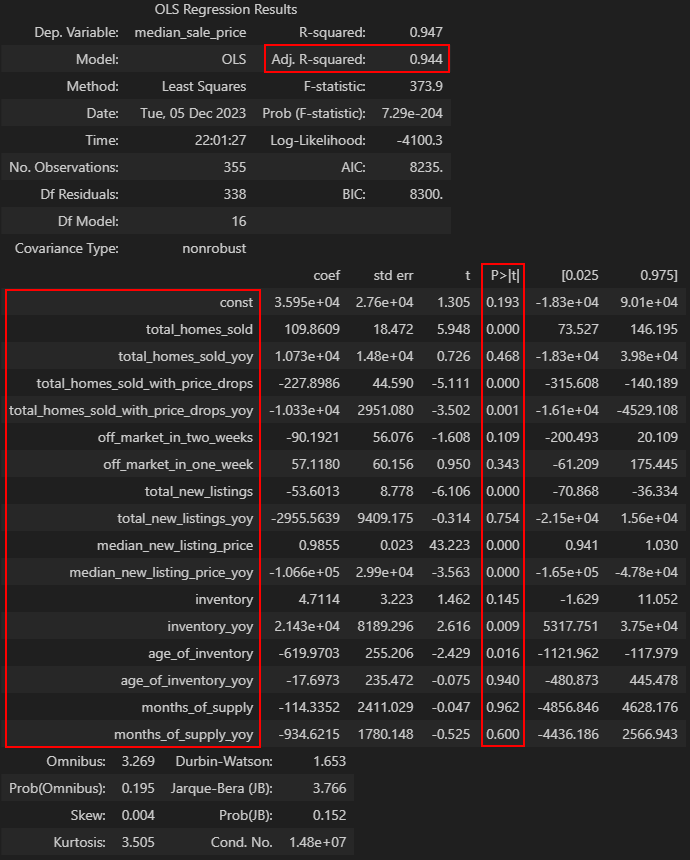

# US Housing Market Analysis

## Project Information

**Members**:

- **Kai Xie:** [ky.xie@mail.utoronto.ca](mailto:ky.xie@mail.utoronto.ca)

- **Nargiz Guliyeva:** [nargiz.guliyeva@mail.utoronto.ca](mailto:nargiz.guliyeva@mail.utoronto.ca)

- **Jerry Li:** [jerbear.li@mail.utoronto.ca](mailto:jerbear.li@mail.utoronto.ca)

**Project Information**: We aimed to analyze trends in the US housing market in the cities of Seattle, New York, and Miami from the beginning of 2017 to the end of 2023. Our data is retrieved from [Redfin], a US-based real estate brokerage that offers up-to-date information on several factors involved in property management. Several factors will be considered, including, but not limited to, number of sales, sales prices, and the speed at which houses are sold. Our analyses encompass various analytics, such as descriptive, diagnostic, predictive, and prescriptive analytics. Rationales and methods for each of these can be found in [Explanation of Analyses](#explanation-of-analyses).

**Course**: INF1340 (Programming for Data Science) \
**Professor:** Dr. Maher Elshakankiri \
**Graduate Unit**: Faculty of Information (iSchool) \
**Assignment**: Final Project (Due December 13th, 2023)

**Date Created**: 2023-11-20, 6:30 pm \
**Last Modified**: 2023-12-12, 8:36 pm

<hr>

## Table of Contents

- [US Housing Market Analysis](#us-housing-market-analysis)
  - [Project Information](#project-information)
  - [Table of Contents](#table-of-contents)
  - [Example Run-Through](#example-run-through)
  - [Project Structure](#project-structure)
  - [Program Flowchart](#program-flowchart)
  - [Program Instructions](#program-instructions)
  - [Dependencies](#dependencies)
  - [Explanation of Analyses](#explanation-of-analyses)
    - [Descriptive Analytics](#descriptive-analytics)
    - [Diagnostic Analytics](#diagnostic-analytics)
    - [Predictive Analytics](#predictive-analytics)
    - [Prescriptive Analytics](#prescriptive-analytics)

<hr>

## Example Run-Through

https://github.com/Jerrryyy/final/assets/114617121/dc2451b3-3d94-479d-9f20-f3c6c082a96e

If the video does not work, it can be found in [`📂resources`](./resources/) as [`🆘example.mp4`](./resources/example.mp4).

<hr>

## Project Structure

<details>
  <summary>
    <b>
      Click here to expand project hierarchy
    </b>
  </summary>

```bash
📦final
+-- 📜README.md
+-- 📜API.md
+-- 📜environment.yml
+-- 🏡analyze_housing.py
+-- 🛠️housing_funcs.py
|
+== 📂data
|   +-- 🧪housing.csv
|   +-- 🧪new_housing.csv
|
+== 📂results
|   +== 📂all_cities
|   |   +--📊top10.png
|   |   +--📊heatmaps.svg
|   |   +--📊svr.svg
|   |   +--📚anova.csv
|   |   +--📚post_hoc.csv
|   |   +--🥒svr_all.pickle
|   |
|   +== 📂nyc
|   |   +== 📂descriptive
|   |   |   +-- 📚summary.csv
|   |   |   +-- 📚monthly_means.csv
|   |   |   +-- 📚normality.csv
|   |   |   +-- 📚variance.csv
|   |   |   +-- 📊histograms.svg
|   |   |   +-- 📊qqplots.svg
|   |   |   +-- 📊violinplots.svg
|   |   |
|   |   +== 📂diagnostic
|   |   |   +-- 📊glm.svg
|   |   |   +-- 📊multicollinearity.svg
|   |   |
|   |   +== 📂predictive
|   |   |   +-- 📊predictions.svg
|   |   |   +-- 📊svr.svg
|   |   |   +-- 🥒svr_nyc.pickle
|   |   |
|   |   +== 📂prescriptive
|   |       +-- 📊coefficients.png
|   |
|   +== 📂seattle
|   |   +== 📂descriptive
|   |   |   +-- 📚summary.csv
|   |   |   +-- 📚monthly_means.csv
|   |   |   +-- 📚normality.csv
|   |   |   +-- 📚variance.csv
|   |   |   +-- 📊longitudinal.svg
|   |   |
|   |   +== 📂diagnostic
|   |   |   +-- 📊correlations.svg
|   |   |
|   |   +== 📂predictive
|   |   |   +-- 📊lasso.svg
|   |   |   +-- 📊ridge.svg
|   |   |   +-- 📊svr.svg
|   |   |
|   |   +== 📂prescriptive
|   |       +-- 📊regression_results.png
|   |
|   +== 📂miami
|       +== 📂descriptive
|       |   +-- 📚summary.csv
|       |   +-- 📚monthly_means.csv
|       |   +-- 📚normality.csv
|       |   +-- 📚variance.csv
|       |   +-- 📊outliers.svg
|       |   +-- 📊annual_sales.svg
|       |   +-- 📊weekly_sales.svg
|       |
|       +== 📂diagnostic
|       |   +-- 📊correlations_strong.svg
|       |   +-- 📊distributions.svg
|       |   +-- 📊homes_sold_months_supply.svg
|       |   +-- 📊price_trends.svg
|       |   +-- 📊sale_price_days_to_close.svg
|       |   +-- 📊sale_price_median_days_to_close.svg
|       |
|       +== 📂predictive
|       |   +-- 📊svr.svg
|       |
|       +== 📂prescriptive
|           +-- 📊forest.svg
|
+== 📂resources
    +-- 🆘example.mp4
    +-- 🆘flowchart.svg
    +-- 📷coefficients.png
    +-- 📷divergence.svg
    +-- 📷heatmaps.svg
    +-- 📷terminal_output.png
    +-- 📷top10.png
    +-- 📄all_results.pdf
```

</details>

<hr>

## Program Flowchart


<hr>

## Program Instructions

The main script, `🏡analyze_housing.py`, uses utilities from `🛠️housing_funcs.py`. **Only 4 files are required to run this program in its entirety**; the two above, `🧪housing.csv`, and `🧪new_housing.csv`. The `📂results` folder ***does not*** need to be present for it to run. As it runs, it will generate results and figures that go into their respective folders (see hierarchy in [Project Structure](#project-structure)). Functions can be found in the [API](./API.md).

1. Navigate or `cd` into the `📦final` directory.
2. Run the following command in `bash` or `terminal`:

   ```bash
   $ python analyze_housing.py data/housing.csv
   ```

3. The program will output status messages as it runs. If any folder is missing, it will automatically generate and populate it with results in the form of `📚.csv`, `📊.svg`, and `📷.png` files.
4. The program is defensively programmed. It will exit with a message and usage example if the user does not provide a valid `🧪.csv` file.

Additionally, each function in the code is written in a manner that can be applied to any or all cities. The current settings were chosen to showcase unique analyses of each city and to significantly reduce the script's runtime. Furthermore, some figures and functions require the entire 3.5 GB+ dataset to run, which *significantly* slows everything down. To mitigate this, some figures are downloaded from pre-generated files from the exact same code, previously run in testing sessions in a Jupyter Notebook, rather than being created concurrently as the program runs.

<hr>

## Dependencies

The project was created within an `Anaconda` environment, with all modules and their versions found in `📜environment.yml`. If the user running the program has `conda` installed, run the following commands in `bash` or `terminal` to initialize the environment to ensure all code runs as intended.

```bash
$ conda env create --file environment.yml
$ conda activate inf1340
```

Optionally, the environment can be given a custom name by including the `--name <env_name>` flag in the first command.

Third-party packages used in the project include the following, and all of their dependencies:

- `numpy 1.26.0`
- `pandas 2.1.1`
- `seaborn 0.13.0`
- `matplotlib 3.8.0`
- `scipy 1.11.3`
- `statsmodels 0.14.0`
- `scikit-learn 1.2.2`
- `scikit-posthocs 0.8.0`
- `gdown 4.7.1`
- `lxml 4.9.3`

If using without this `conda` environment, these packages can be installed using `pip install <pkg_name>==<version>` within `bash` or `terminal`. Alternatively, within another `conda` environment, use `conda install <pkg_name>=<version>`.

<hr>

## Explanation of Analyses

[Redfin], a real estate brokerage based in the United States, possesses direct access to data sourced from multiple local listing services, complemented by insights gleaned from their network of real estate agents nationwide. This unique access empowers them to provide the earliest and most dependable data regarding the state of the housing market. They excel in publishing existing industry data with remarkable speed, and they offer exclusive data pertaining to property tours and offers that remain unmatched by others. Individuals can easily visualize and download housing market data for various geographic scopes, including metropolitan areas, cities, neighbourhoods, and zip codes throughout the entire nation.

Understanding housing market analysis is of paramount importance, as it allows individuals and professionals to make informed decisions in the real estate sector. By harnessing the data provided by [Redfin], one can gain valuable insights into market trends, pricing dynamics, and property demand. This information empowers both buyers and sellers to make strategic choices. In the ever-evolving world of real estate, access to comprehensive and up-to-date market data is a valuable asset for making informed decisions.

### Descriptive Analytics

- Preliminary data cleaning, removing outliers, filling missing values
- Descriptive statistics: min, mean, median, max, range, standard deviation, and standard error
- Distributional analyses: Q-Q plots, histograms, skewness, kurtosis, and normality (Shapiro-Wilk) and variance (Levene) tests

### Diagnostic Analytics

- Longitudinal plots for trend investigations
- Divergence analysis
- Correlation heatmaps
- Non-parametric analysis of variance (Kruskal-Wallis H-test)
- Non-parametric post-hoc comparison tests (Wilcoxon rank-sum/Mann-Whitney U test)

### Predictive Analytics

- Various regression analyses and evaluation of performance using train-test splits:
  - Ordinary Least Squares (OLS) regression
  - Generalized Linear Model (GLM) regression
  - Lasso and Ridge regression
  - Random Forest regression
- Machine learning models and evaluation of performance using train-test splits and 10-fold cross-validation, followed by prediction of new, unseen data and prediction accuracy:
  - Support Vector regression (SVR)

### Prescriptive Analytics

To better understand market dynamics in Seattle, one can infer useful information from the output of its regression table (shown below). We can see that the variables selected have an adjusted R<sup>2</sup> of 0.944.



- From the results, we can see that transaction **volume** has a meaningful impact on the level of home prices: `total_homes_sold` has a significantly positive effect on Seattle's home price, while the year-over-year (`yoy`) change in total homes sold has a significantly negative effect. This suggests that, although home prices increase alongside total transaction volume, a "surge" in volume would actually lead to a decline in home prices, possibly due to the market being "swamped" by increased supply (i.e., more sellers than buyers).
- From the results, the level of **distress** in the market negatively impacts home prices. Specifically, `total_homes_sold_with_price_drops` has a significantly negative effect on home prices, and the effect of year-over-year change in total homes sold with price drops is also significantly negative. This suggests a "slippery slope" impact: price cuts coupled with an increase in price cuts, could serve as a "double whammy" for home prices.
- From the results, the most **popular** or **demanded** cohort of homes does not have a significant impact on home prices. Specifically, if one were to measure popular (i.e., more demand/desired) cohorts as homes that are sold or taken `off_market_in_one_week` or `two_weeks`, the coefficients on both are insignificant. This suggests that particular "hotness" of the market tends to be contained, and not materially "spreading" to impact overall home prices.
- Sellers' **asking prices** (`new_listing_price`) have a significantly positive correlation with median sales price, which is very intuitive. Interestingly, year-over-year changes in listing price exhibit a significantly negative correlation with sale prices. This is in line with the observation from the total homes sold metrics. As there are more sellers, and listing prices get overly increased, home prices could actually be negatively impacted.
- **Supply** in Seattle paints a mixed, but interesting, story. Here, we break down the notion of "housing supply" into its various forms or sources.
  - First, when viewed through the lens of `total_new_listings` (i.e., amount of new/fresh supply/interest in selling) in the market, an increase in new listings correlates with a statistically significant decline in home prices.
  - Second, when viewed through `total_inventory` (the total number of active listings on the market), the level itself actually does not have a statistically significant impact. However, the year-over-year change in inventory has a significantly positive correlation with home prices.
  - Third, `age_of_inventory` has a significantly negative correlation with home prices. Age of inventory is measured as the number of days active inventory has been on the market. As homes continue to stay on the market without being bought, this indicates demand is weaker than supply.
  - An interesting question arises: How can one reconcile the observations from the first and second point? The key takeaway is that housing prices benefit from stable availability of housing supply (which is measured by year-over-year change in total inventory). However, a sudden shock in new supply, which is measured by new listings during each time period (1-week in our analyzed dataset), causes a contemporaneous negative shock to home prices.
- **Policy recommendation**: Given the backdrop in this analysis, policy recommendations should be two-fold. Policy should be aimed at improving affordability and maintaining home price stability. Therefore, Seattle should continue to expand available housing, increasing housing supply at a gradual pace, while closely monitoring any abnormal activity in particular areas of the market to avoid potential shocks to the system (either excessive aging of inventory, excessive popularity of certain cohorts, or sudden supply shocks). Furthermore, the city should also construct more buyer-friendly assistance programs, such as initiatives that provide lower cost loans for first-time homebuyers and deeper collaborations with banks and non-bank lenders to better understand the city's evolving demographics. The initiatives should be designed with the purpose to help boost transaction volumes, and serve as a good matching mechanism to help different buyers with different needs find appropriate homes.

Prescriptive analytics for Miami can be found in [📄all_results.pdf](./resources/all_results.pdf), which includes an overview of all analyses done on the Miami housing market.

[Redfin]: https://www.redfin.com/news/data-center/
